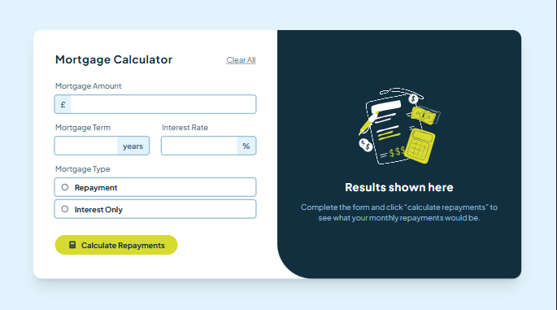

# Mortgage Repayment Calculator
This is a mortgage repayment calculator built using HTML, Tailwind CSS, and JavaScript.

## Features
- Input mortgage details to see monthly and total repayment amounts
- Form validation with error messages for incomplete fields
- Responsive design optimized for all screen sizes
- Hover and focus states for all interactive elements

## Demo

## Contact
Feel free to reach out or connect with me:
[My linked profile](https://www.linkedin.com/in/apeksha-shrestha/)

## Acknowledgements
This project is part of a Frontend Mentor challenge and was completed solely for learning purposes.
Take a look and let me know what you think!